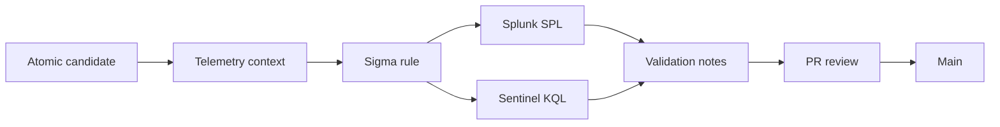

# Workflow

This repo uses a small evidence-bound workflow for one public-safe detection translation candidate at a time.

## Candidate Intake

A collaborator proposes one Atomic Red Team-style candidate and enough high-level context to understand the intended telemetry path.

## Telemetry Context

The repo records the telemetry source, expected event relationship, and field-mapping assumptions without including private data, raw sensitive telemetry, lab IP addresses, or secrets.

## Sigma Rule

A Sigma rule is proposed only after candidate context is documented. The rule remains a proposal until review and evidence support any stronger claim.

## Splunk SPL Translation

The Sigma proposal is translated to Splunk SPL after the relevant field mapping and platform assumptions are documented.

## Sentinel KQL Translation

The Sigma proposal is translated to Microsoft Sentinel KQL after the relevant field mapping and platform assumptions are documented.

## Validation Notes

Validation notes record what was reviewed, what evidence exists in the repo, and what remains unvalidated.

## Pull Request Review

Candidate changes should move through a pull request. Claims must stay tied to the evidence included in the repo.

## Merge

Merge to `main` only after human review. No stage is complete until the related evidence is present and reviewed.

